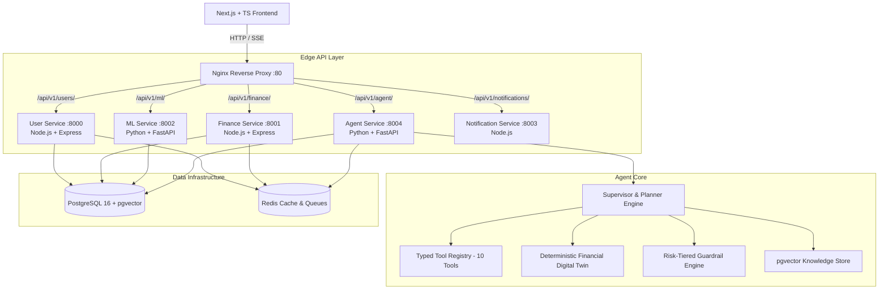

# ALPHAQUANT
### Agentic Financial Intelligence Platform

> **AlphaQuant** is a distributed, agentic financial decision-support platform. It replaces probabilistic LLM math with a **deterministic financial digital twin**, orchestrates microservices via a **supervisor planning engine**, retrieves domain knowledge using **pgvector RAG**, enforces **risk-tiered tool guardrails**, and provides an **evaluable execution harness** with **real-time agent tracing**.

---

##  Executive Summary & Metrics

```text
========================================================================
                      ALPHAQUANT AGENT EVALUATION                       
========================================================================
 Scenarios Evaluated            : 8 Multi-Step Financial Benchmarks
 Task Completion Rate           : 100.0%
 Tool Selection Accuracy        : 100.0%
 Invalid Tool Call Rate         : 0.0%
 Safety Violation Rate          : 0.0% (Zero unauthorized actions)
 Average Tool Calls / Task      : 3.12
========================================================================
```

---

##  System Architecture

AlphaQuant uses an event-driven, microservice architecture fronted by an Nginx reverse proxy. The **Agent Service** acts as an autonomous orchestrator across existing domain services (`User Service`, `Finance Service`, and `ML Service`) without duplicating business logic.



---

##  Agent Execution & Digital Twin Flow

```text
User Question / Query
      │
      ▼
┌─────────────────────────────────────────────────────────┐
│ Supervisor Planner & Capability Router                  │
│ Capabilities: [Financial Analysis] [Goals] [Simulation] │
└──────────────────────────┬──────────────────────────────┘
                           │
                           ▼
┌─────────────────────────────────────────────────────────┐
│ Risk-Tiered Guardrails Check                            │
│ AUTOMATIC | CONFIRMATION_REQUIRED | FORBIDDEN           │
└──────────────────────────┬──────────────────────────────┘
                           │
                           ▼
┌─────────────────────────────────────────────────────────┐
│ Typed Tool Execution                                    │
│ (get_financial_profile, calculate_cash_flow, etc.)      │
└──────────────────────────┬──────────────────────────────┘
                           │
                           ▼
┌─────────────────────────────────────────────────────────┐
│ Deterministic Financial Digital Twin Engine             │
│ Current State ──> Clone ──> Apply Delta ──> Recalculate │
│ (Zero LLM Math: EMI, DTI, Surplus, Health Delta)        │
└──────────────────────────┬──────────────────────────────┘
                           │
                           ▼
┌─────────────────────────────────────────────────────────┐
│ Structured Action Plan & Streaming Agent Trace UI       │
└─────────────────────────────────────────────────────────┘
```

---

##  Signature Features

### 1. Deterministic Financial Digital Twin Engine
- **Zero LLM Mathematics**: Financial calculations (EMI, Debt-to-Income ratio, monthly surplus deltas, health score shifts, and goal delays) are calculated using 100% deterministic code.
- **State Cloning**: Creates an immutable copy of `FinancialState` (`income`, `expenses`, `assets`, `liabilities`, `savings`, `investments`, `goals`), applies proposed changes (e.g. ₹15 lakh car loan or ₹10 lakh home down payment goal), recalculates metrics, and compares against baseline.

### 2. Autonomous Supervisor & Planning Engine
- Decomposes user questions into structured execution steps.
- Routes queries dynamically across 3 primary capabilities:
  - `Simulation`: Evaluates loan affordability, EMI impact, and surplus changes.
  - `Goals Feasibility`: Computes exact required monthly SIP allocations (Growth Equity Mutual Funds vs Liquid Emergency Funds) and step-up roadmaps.
  - `Financial Analysis`: Analyzes overall wellness score, expense trends, and budgeting rules.

### 3. Risk-Tiered Tool Guardrails
Explicit permission taxonomy prevents unauthorized actions:
-  **AUTOMATIC**: Read data (`get_financial_profile`, `get_transaction_summary`, `calculate_cash_flow`, `simulate_loan`, `simulate_financial_scenario`, `search_financial_knowledge`).
- **CONFIRMATION_REQUIRED**: Mutate state (`create_goal`, `create_transaction`, `update_budget`).
-  **FORBIDDEN**: High-risk actions (`move_money`, `execute_wire_transfer`, `delete_account`).

### 4. RAG with PostgreSQL `pgvector`
- Uses vector similarity search over PostgreSQL `pgvector` for financial concepts (emergency fund 3-6 month rule, 50/30/20 budget method, DTI limits, 20/4/10 car buying rule).

### 5. Evaluation Harness & Metrics
- Includes a standalone benchmark harness (`app/evaluation/runner.py`) running multi-step test scenarios (`financial_scenarios.json`).
- Measures **Task Completion Rate**, **Tool Selection Accuracy**, **Invalid Tool Call Rate**, **Average Tool Calls per Task**, and **Safety Violation Rate**.

---

##  Technology Stack

| Layer | Technology |
|---|---|
| **Frontend** | Next.js 14 (App Router), TypeScript, Tailwind CSS |
| **Backend Services** | Node.js (Express), Python 3.11 (FastAPI) |
| **AI / Agent Framework** | Custom Supervisor State Machine, LangChain Core, Pydantic |
| **Database** | PostgreSQL 16 with `pgvector` extension |
| **Cache & Event Queue** | Redis 7 |
| **Reverse Proxy** | Nginx |
| **Containerization** | Docker, Docker Compose |
| **Testing & Evaluation** | Pytest, Custom Agent Evaluation Runner |

---

##  Repository Structure

```text
financial_wellness_platform/
├── backend/
│   └── services/
│       ├── agent-service/               # Agentic Decision-Support Microservice (Port 8004)
│       │   ├── app/
│       │   │   ├── agent/               # Supervisor, state machine, executor
│       │   │   ├── api/                 # FastAPI endpoints (/chat)
│       │   │   ├── clients/             # Async HTTP bindings to other services
│       │   │   ├── config/              # Pydantic Settings & environment
│       │   │   ├── digital_twin/        # Immutable state engine & scenario clone
│       │   │   ├── evaluation/          # Benchmark harness & test scenario dataset
│       │   │   ├── guardrails/          # Risk tier permissions engine
│       │   │   ├── observability/       # Latency & trace timeline logger
│       │   │   ├── rag/                 # pgvector store & financial knowledge
│       │   │   ├── schemas/             # Pydantic request/response DTOs
│       │   │   └── tools/               # 10 typed production-safe tools
│       │   ├── tests/                   # Pytest test suite for Digital Twin
│       │   ├── Dockerfile
│       │   └── requirements.txt
│       ├── user-service/                # Auth & user profile service (Node.js, Port 8000)
│       ├── finance-service/             # Transactions, budgets, loans, goals (Node.js, Port 8001)
│       ├── ml-service/                  # ML clustering, career & spending prediction (Python, Port 8002)
│       └── notification-service/        # Email/SMS budget alert worker (Node.js, Port 8003)
├── frontend/                            # Next.js App Router UI (Port 3000)
│   ├── app/(dashboard)/
│   │   ├── agent/                       # Streaming Agent Trace UI
│   │   ├── dashboard/                   # Real-time financial dashboard
│   │   ├── onboarding/                  # Cut-and-SIP onboarding planner
│   │   ├── transactions/                # Cashflow transaction manager
│   │   ├── investments/                 # ML cluster investment recommendations
│   │   └── career/                      # ML career growth planner
├── infrastructure/
│   ├── docker/
│   │   ├── docker-compose.yml           # Unified multi-container stack
│   │   └── nginx.conf                   # Reverse proxy routing
└── scripts/                             # Seeding & utility scripts
```

---

##  Quickstart & Setup

### Prerequisites
- Docker & Docker Compose installed
- Python 3.11+ (for local test runner execution)

### 1. Run via Docker Compose
```bash
cd infrastructure/docker
docker-compose up --build
```
Access the application at:
- **Frontend Dashboard**: `http://localhost/dashboard`
- **Agent Intelligence UI**: `http://localhost/agent`
- **Agent Service API**: `http://localhost/api/v1/agent/health`

### 2. Run Agent Tests & Evaluation Harness Locally
```bash
cd backend/services/agent-service

# Run Digital Twin Unit Tests
cmd /c "set PYTHONPATH=. && pytest tests/ -v"

# Run Agent Evaluation Harness
cmd /c "set PYTHONPATH=. && python -m app.evaluation.runner"
```

---

##  The Project Narrative

> *"AlphaQuant started as a distributed financial wellness platform. I evolved it into an agentic decision-support system rather than simply adding an LLM chatbot. The agent can decompose financial questions, call typed tools exposed by existing microservices, run deterministic financial simulations, retrieve relevant financial knowledge through RAG, and produce an explainable recommendation. I built an evaluation harness to measure tool selection and task completion and added risk-based guardrails so the agent cannot perform unauthorized financial actions."*
